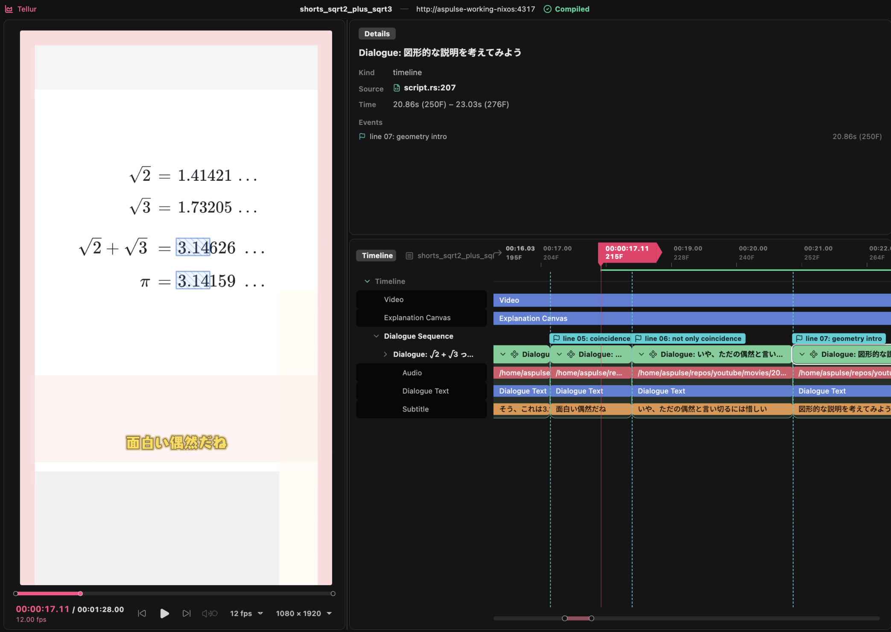

<h1 align="center">Tellur</h1>

<p align="center">
  <a href="https://crates.io/crates/tellur"></a>
  <a href="https://docs.rs/tellur"></a>
  <a href="https://github.com/comnipl/tellur/actions/workflows/rust.yml"></a>
  <a href="LICENSE"></a>
</p>

<p align="center">
  <i>Rust製動画編集・映像制作ライブラリ</i>
</p>

<p>
  <a href="README.md">English(英語)</a>
</p>

<hr />

<p align="center">
  
  
</p>

Tellurは、コンポーネント指向の動画編集ライブラリです。  
さまざまな動画スタイルに対応できる汎用用途のライブラリを目指しています。
- モーショングラフィックスのようなリッチな表現
- バラエティ的なテロップ
- 解説動画のような落ち着いたテイスト など


動画内の各要素を下のようなコンポーネントの組み合わせで表現します。

```rust
#[component(vector)]
fn Dot(center: Vec2, radius: f32, color: Color) -> impl VectorComponent {
    Circle::builder()
        .radius(radius)
        .fill(Fill {
            paint: Paint::Solid(color),
        })
        .anchored(Anchor::CENTER)
        .snap_to(center)
}
```

コンポーネントは純粋関数的であり、これによりサブツリー単位のキャッシュを実現します。

また、ほとんどのビルトインコンポーネントにおいてGPUレンダリングを実装しており、非常に高速です。


## 類似ツールとの比較

**[Remotion](https://www.remotion.dev/)** (React)

- 主に優れる点: ラスタライザを自前で持つため、HTML/CSSの域を飛びだすリッチな表現が簡単
- 主に劣る点: 書き味は JSX の簡潔さに敵わない

**[Manim](https://www.manim.community/)** (Python)

- 主に優れる点: レンダリングが高速で、タイムライン・レイアウト・ライブプレビューなどジャンルを問わない動画制作の道具が揃っている
- 主に劣る点: 込み入った数学的な表現はまだ未熟


## はじめ方

`tellur create` でタイムラインプロジェクトをひな形から作れます。`Cargo.toml`
（`cdylib` クレート）とサンプルシーンが生成され、Cargo ワークスペース内で
実行した場合はメンバー登録と `tellur` 依存も自動で整えます。

```console
$ tellur create my-video
```

`--title` でタイムラインの表示名を指定できます（省略時はディレクトリ名）。

## ライブプレビュー

`tellur live` はプロジェクトをホットリビルドしながらブラウザでプレビュー
します。

```console
$ tellur live --project path/to/your-video --gpu
```

<p align="center">
  
</p>

## クレート構成

| crate | 役割 |
|---|---|
| [`tellur`](https://crates.io/crates/tellur) | Facade。下記すべてを再エクスポート。`tellur` CLI(`cli` feature) |
| [`tellur-core`](https://crates.io/crates/tellur-core) | コンポーネントモデル、レイアウト、イージング、イベント、テキスト、LaTeX 数式 |
| [`tellur-renderer`](https://crates.io/crates/tellur-renderer) | GPU/CPU ラスタライズと ffmpeg エンコード |
| [`tellur-macros`](https://crates.io/crates/tellur-macros) | `#[component]` と `#[derive(Keyable)]` |
| [`tellur-live`](https://crates.io/crates/tellur-live) | ライブプレビューサーバー |
| [`tellur-plugin`](https://crates.io/crates/tellur-plugin) | ライブプレビューが使う dynamic library ABI |

## 動作要件

- **ffmpeg**: エンコードに必要です。
- **fontconfig** (Linuxのみ): フォント検出に必要です。

## ドキュメント

体系的なチュートリアルは整備中です。

## ライセンス

MIT
